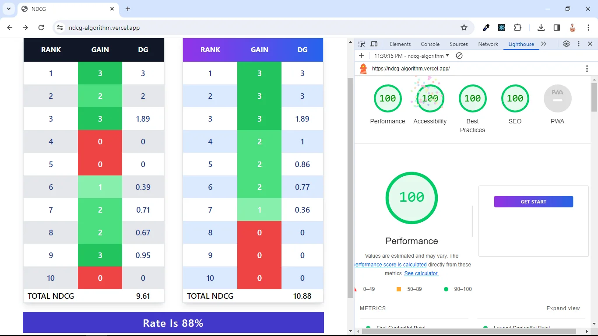

# NDCG Calculator 🌟

Welcome to the NDCG Calculator application! 🎉 This project allows you to calculate the Normalized Discounted Cumulative Gain (NDCG) for a set of ranked retrieval links, turning your information retrieval performance evaluation into a breeze! ⚡️

## Introduction 📜

The NDCG Calculator is a high-performance and accessible tool designed to measure the effectiveness of your information retrieval systems. By considering both the relevance and position of retrieved documents, it provides you with valuable insights into the quality of your ranking algorithms. With its intuitive interface and lightning-fast calculations, you can now evaluate your retrieval performance with ease! 💡

## Theory of NDCG 🧠

# NDCG Calculator 🌟

Welcome to the NDCG Calculator application! 🎉 This project allows you to calculate the Normalized Discounted Cumulative Gain (NDCG) for a set of ranked retrieval links, turning your information retrieval performance evaluation into a breeze! ⚡️

**Live Demo:** https://ndcg-algorithm.vercel.app/

## Introduction 📜

The NDCG Calculator is a high-performance and accessible tool designed to measure the effectiveness of your information retrieval systems. By considering both the relevance and position of retrieved documents, it provides you with valuable insights into the quality of your ranking algorithms. With its intuitive interface and lightning-fast calculations, you can now evaluate your retrieval performance with ease! 💡

## Theory of NDCG 🧠

NDCG takes into account the gain (relevance) and position (rank) of each retrieved document. It calculates the Discounted Cumulative Gain (DCG) for the ranked list of documents and then normalizes it to obtain the NDCG score. This allows you to assess the impact of relevance and positioning in your retrieval system, enabling you to fine-tune and optimize your algorithms for superior user experiences! 📈

## Features ✨

- 🚀 High-performance: Utilizes Vite and React to deliver a blazing-fast user experience.
- ♿ Accessible: Built with accessibility in mind, ensuring inclusion for all users.
- 🔍 SEO-friendly: Optimized for search engines to enhance the discoverability of your project.
- 📋 Input ten ranked retrieval links and their corresponding gains.
- 🔄 Calculate the Discounted Cumulative Gain (DCG) for each link based on its gain and rank.
- 📊 Display a table showing the rank, gain, and DCG for each link.
- 🔀 Arrange the table data based on the gain in descending order.
- 🔄 Generate a new table with the rearranged data.
- 📈 Calculate the NDCG by dividing the total DCG of the rearranged table by the total DCG of the original table.

## Technologies Used 🛠️

This project is built using the following technologies:

- ⚛️ React: A JavaScript library for building user interfaces.
- 🚀 Vite: A fast build tool for modern web applications.
- 🌐 TypeScript: A statically-typed superset of JavaScript.
- 💻 Headless UI: A set of accessible and reusable UI components.
- 🎨 Heroicons: A collection of open-source icons.

## Demo 🌐

Check out the live demo of the NDCG Calculator [here](https://ndcg-algorithm.vercel.app/). Experience the power and simplicity of this tool firsthand!

## Usage 🚀

1. 🧪 Clone the repository: `git clone https://github.com/your-username/ndcg-calculator.git`
2. 📂 Navigate to the project directory: `cd ndcg-calculator`
3. 📦 Install the dependencies: `npm install`
4. ▶️ Start the application: `npm run dev`
5. 🌐 Open your browser and visit: `http://localhost:3000`

Follow the on-screen instructions to input the gains for each ranked retrieval link and view the calculated NDCG. ✨

## Contributing 🤝

Contributions are welcome! If you have any suggestions, bug reports, or feature requests, please open an issue or submit a pull request. We appreciate your input as we strive to make the NDCG Calculator even better! 🙌
NDCG takes into account the gain (relevance) and position (rank) of each retrieved document. It calculates the Discounted Cumulative Gain (DCG) for the ranked list of documents and then normalizes it to obtain the NDCG score. This allows you to assess the impact of relevance and positioning in your retrieval system, enabling you to fine-tune and optimize your algorithms for superior user experiences! 📈

## Features ✨

- 🚀 High-performance: Utilizes Vite and React to deliver a blazing-fast user experience.
- ♿ Accessible: Built with accessibility in mind, ensuring inclusion for all users.
- 🔍 SEO-friendly: Optimized for search engines to enhance the discoverability of your project.
- 📋 Input ten ranked retrieval links and their corresponding gains.
- 🔄 Calculate the Discounted Cumulative Gain (DCG) for each link based on its gain and rank.
- 📊 Display a table showing the rank, gain, and DCG for each link.
- 🔀 Arrange the table data based on the gain in descending order.
- 🔄 Generate a new table with the rearranged data.
- 📈 Calculate the NDCG by dividing the total DCG of the rearranged table by the total DCG of the original table.

## Technologies Used 🛠️

This project is built using the following technologies:

- ⚛️ React: A JavaScript library for building user interfaces.
- 🚀 Vite: A fast build tool for modern web applications.
- 🌐 TypeScript: A statically-typed superset of JavaScript.
- 💻 Headless UI: A set of accessible and reusable UI components.
- 🎨 Heroicons: A collection of open-source icons.

## Demo 🌐

Check out the live demo of the NDCG Calculator [here](https://ndcg-algorithm.vercel.app/). Experience the power and simplicity of this tool firsthand!

## Usage 🚀

1. 🧪 Clone the repository: `git clone https://github.com/your-username/ndcg-calculator.git`
2. 📂 Navigate to the project directory: `cd ndcg-calculator`
3. 📦 Install the dependencies: `npm install`
4. ▶️ Start the application: `npm run dev`
5. 🌐 Open your browser and visit: `http://localhost:3000`

Follow the on-screen instructions to input the gains for each ranked retrieval link and view the calculated NDCG. ✨

## Contributing 🤝

Contributions are welcome! If you have any suggestions, bug reports, or feature requests, please open an issue or submit a pull request. We appreciate your input as we strive to make the NDCG Calculator even better! 🙌
